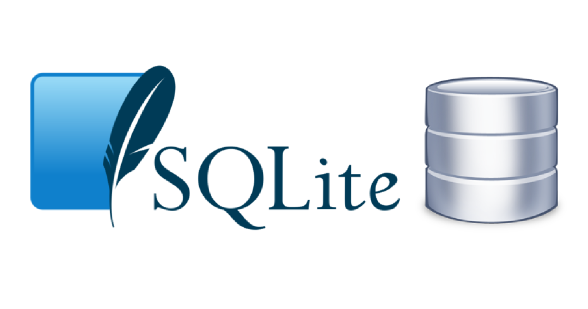
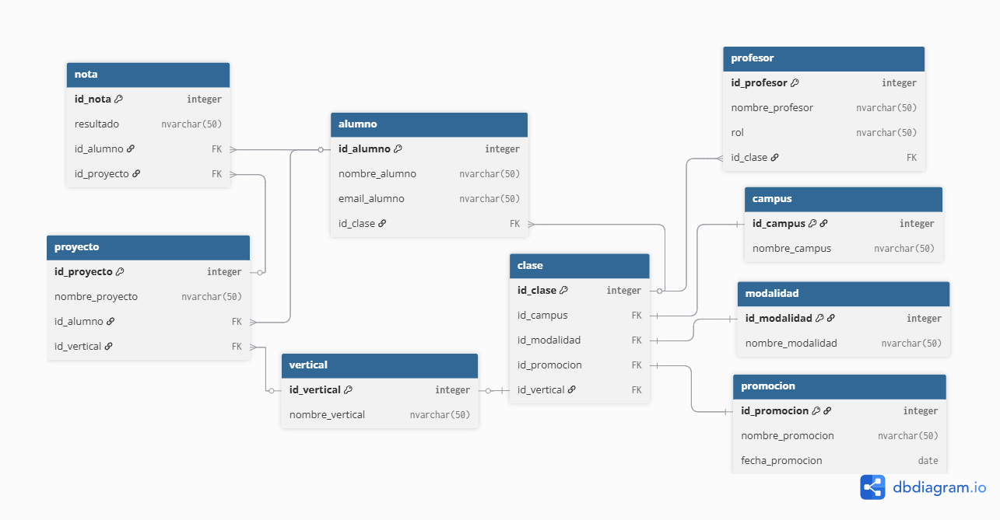

  

# Proyecto de Creación de Base de Datos SQLite - The Bridge

Este proyecto tiene como objetivo la **creación de una base de datos SQLite mediante Python**, con el fin de almacenar y gestionar información ficticia sobre diferentes **clases y claustros** de The Bridge.  

El trabajo se ha desarrollado como práctica de **modelado, normalización e implementación de bases de datos relacionales**, utilizando datos simulados de distintas promociones.

---

## 📁 Organización de Carpetas

La estructura del proyecto es la siguiente:

```
Proyecto_SQL/
│
├── data/
│   ├── clase_1.csv      # Data Science Madrid - Septiembre
│   ├── clase_2.csv      # Data Science Madrid - Febrero
│   ├── clase_3.csv      # Full Stack Madrid - Septiembre
│   ├── clase_4.csv      # Full Stack Valencia - Febrero
│   └── claustro.csv     # Información de los profesores
│
├── img/
│   ├── Modelo_Entidad_Relacion.jpg
│   ├── Modelo_logico_BBDD.png
│   └── Versión_antigua/
│       └──versiones antiguas de las imagenes
│      
│
├── src/
│   └── Versión_antigua/
│       └── version de prueba del notebook
│
├── Proyecto_SQL.db
└── Proyecto_SQL.ipynb   # Notebook principal del proyecto
```

---

## 📚 Descripción del Proyecto

El notebook principal **`Proyecto_SQL.ipynb`** desarrolla paso a paso la creación de la base de datos `Proyecto_SQL.db`, la cual almacena la información de las promociones y el claustro docente.  

Los principales objetivos son:
- Unificar los datos de distintas fuentes (archivos CSV).
- Diseñar y crear un modelo entidad-relación coherente.
- Crear tablas normalizadas en SQLite.
- Insertar registros automáticamente desde Python.
- Realizar consultas SQL de validación.

---

## 🧾 Descripción de los Datasets

| Archivo | Descripción | Tipo de datos |
|----------|--------------|---------------|
| `clase_1.csv` | Estudiantes de la promoción **Data Science Madrid - Septiembre** | Nombres, apellidos, email, etc. |
| `clase_2.csv` | Estudiantes de la promoción **Data Science Madrid - Febrero** | Igual estructura que clase_1 |
| `clase_3.csv` | Estudiantes de la promoción **Full Stack Madrid - Septiembre** | Igual estructura que clase_1 |
| `clase_4.csv` | Estudiantes de la promoción **Full Stack Valencia - Febrero** | Igual estructura que clase_1 |
| `claustro.csv` | Profesores y staff de The Bridge | Nombre, rol, vertical, campus |

---

## ⚙️ Requisitos

Para ejecutar correctamente el notebook es necesario tener instaladas las siguientes librerías de Python:

```bash
pip install pandas
pip install sqlite3
pip install os
```

> 💡 *Nota:* `sqlite3` y `os` vienen preinstaladas en la mayoría de distribuciones de Python.

---

## Modelos lógicos



---

## 📖 Estructura del Notebook

#### Índice  
1. [Importación de librerías](#importación-de-librerias)  
2. [Importación de datos](#importacion-de-datos-de-partida)  
3. [Creación de tablas](#creación-de-tablas)  
4. [Insertar registros](#insertar-registros)  
5. [Query](#pruebas-de-query)

---

## 🧑‍💻 Autores

Proyecto realizado por:

- **Álvaro Medina Fernández [LinkedIn](http://www.linkedin.com/in/álvaro-medinafernández) | [GitHub](https://github.com/Meferal)**  
- **Albert [LinkedIn](http://linkedin.com/in/albert-andres-palop) | [GitHub](https://github.com/alandpal)**  
- **Juan Carlos [LinkedIn](http://www.linkedin.com/in/juajiza) | [GitHub](https://github.com/juajiza-prog)**  

Bajo la supervisión de **Borja Barber [GitHub](https://github.com/borjabarber)** , *Lead Instructor en The Bridge*.

---

## 📜 Licencia

Este proyecto está distribuido bajo la licencia **MIT**.  
Puedes consultar los términos completos en el archivo `LICENSE`.
